# UAS Risk Assessment Library

This repository provides a C++ library with Python bindings for Unmanned Aircraft Systems (UAS) risk assessment. It allows users to model and evaluate risks associated with UAS operations in a 3D environment.

## Table of Contents

- [Project Summary](#project-summary)
- [Modules](#modules)
- [Relationship with `uasgroundrisk`](#relationship-with-uasgroundrisk)
- [Architecture Diagram](#architecture-diagram)
- [Usage Examples](#usage-examples)

## Project Summary

The `uasrisk` library is designed to calculate and represent risks for UAS flights. It utilizes voxel grids to discretize 3D space and assign risk values to each voxel. This enables detailed risk analysis for flight planning and operational decision-making. The library supports different types of risk, including ground risk (risk to people and property on the ground) and air risk (risk of collision with other aircraft).

## Modules

The library is composed of several key modules, available through its Python bindings (`pyuasrisk`):

*   **`VoxelGrid`**: The base class for representing 3D gridded data (`ur::environment::VoxelGrid`). It provides fundamental operations for creating, accessing, and manipulating voxel data, including coordinate transformations between world (geospatial) and local grid indices.
*   **`GridMap`**: A 2D grid representation (`ugr::gridmap::GridMap`), primarily used by components from the `uasgroundrisk` library.
*   **`GeospatialGridMap`**: A specialized `GridMap` (`ugr::mapping::GeospatialGridMap`) that incorporates geospatial referencing (latitude, longitude).
*   **`AircraftStateModel` & `AircraftModel`**: Classes for defining the state (position, velocity - `ugr::risk::AircraftStateModel`) and characteristics (mass, dimensions, failure probabilities, descent models - `ugr::risk::AircraftModel`) of a UAS. These models are crucial for simulating failure scenarios.
*   **`PopulationMap` & `TemporalPopulationMap`**: Modules for representing population density (`ugr::mapping::PopulationMap`), with `TemporalPopulationMap` allowing for time-varying population data. These are integrated from `uasgroundrisk`.
*   **`ObstacleMap`**: Represents obstacles in the environment (`ugr::risk::ObstacleMap`), such as buildings, often derived from sources like OpenStreetMap (OSM).
*   **`WeatherMap`**: Incorporates weather data (`ugr::risk::WeatherMap`), like wind conditions, into the risk assessment.
*   **`GroundRiskVoxelGrid` Types**:
    *   **`FullGroundRiskVoxelGrid`**: (`ur::GroundRiskVoxelGrid` in C++, exposed via a specific constructor pattern in Python) This class calculates comprehensive ground risk, integrating `PopulationMap`, `AircraftModel`, `ObstacleMap`, and `WeatherMap`. It evaluates the risk for each voxel as if a failure occurred there.
    *   **`GroundRiskVoxelGrid`**: (Exposed as `pyuasrisk.GroundRiskVoxelGrid`) A C++ helper class (`PyGroundRiskVoxelGrid`) that simplifies setup by managing internal default maps for population, obstacles, and weather. It still uses an `AircraftModel` and calculates risk across the voxel grid.
    *   **`IncrementalGroundRiskVoxelGrid`**: (`ur::ground::IncrementalGroundRiskVoxelGrid`, exposed as `pyuasrisk.IncrementalGroundRiskVoxelGrid`) This class is designed for on-demand risk calculation for specific failure events (defined by a point of failure and aircraft heading). It provides methods like `getPositionPointStrikeProbability` and `getPositionPointFatalityProbability` rather than populating entire grid layers with an `eval()` call.
*   **`AirRiskVoxelGrid`**: (`ur::air::AirRiskVoxelGrid`, exposed as `pyuasrisk.AirRiskVoxelGrid`) Calculates the risk of mid-air collisions. It uses trajectory data (e.g., from OpenSky) and airspace definitions (e.g., from OpenAIP) to estimate collision probabilities within each voxel.
*   **`RiskVoxelGrid`**: (`ur::RiskVoxelGrid`, exposed as `pyuasrisk.RiskVoxelGrid`) A composite grid that combines outputs from an internal `AirRiskVoxelGrid` and a `GroundRiskVoxelGrid` (which itself uses population, obstacle, weather, and aircraft models) to provide an overall risk assessment. It has an `eval()` method that triggers evaluation of all components.

## Relationship with `uasgroundrisk`

The `uasrisk` library significantly leverages and builds upon functionalities from the `uasgroundrisk` repository. The `uasgroundrisk` project provides the foundational elements for 2D ground risk assessment, which `uasrisk` then extends into a 3D context and combines with air risk.

Key `uasgroundrisk` components utilized include:

*   **Core Mapping**: `ugr::gridmap::GridMap` and `ugr::mapping::GeospatialGridMap` for 2D spatial data representation and geospatial awareness.
*   **Environmental Data Models**:
    *   `ugr::mapping::PopulationMap` and `ugr::mapping::TemporalPopulationMap` for population distribution.
    *   `ugr::risk::ObstacleMap` for obstacle representation.
    *   `ugr::risk::WeatherMap` for weather conditions.
*   **Aircraft Modeling**: `ugr::risk::AircraftModel` provides the detailed aircraft characteristics, including various descent models (glide, ballistic, parachute), which are essential for simulating impact footprints.

`uasrisk` takes these 2D concepts and data structures, integrates them into its 3D `ur::environment::VoxelGrid` framework, and adds new capabilities like `ur::air::AirRiskVoxelGrid`. The Python bindings (`pyuasrisk`) then expose this integrated 3D risk assessment toolkit.

## Architecture Diagram

```mermaid
graph TD
    subgraph PythonBindings [Python Interface - pyuasrisk]
        direction LR
        PyVoxelGrid[VoxelGrid]
        PyGridMap[GridMap]
        PyGeoGridMap[GeospatialGridMap]
        PyAircraftModel[AircraftModel]
        PyPopMap[PopulationMap]
        PyTempPopMap[TemporalPopulationMap]
        PyObstacleMap[ObstacleMap]
        PyWeatherMap[WeatherMap]
        PyFullGroundRisk[FullGroundRiskVoxelGrid]
        PyGroundRisk[GroundRiskVoxelGrid]
        PyIncGroundRisk[IncrementalGroundRiskVoxelGrid]
        PyAirRisk[AirRiskVoxelGrid]
        PyRiskVoxelGrid[RiskVoxelGrid]
    end

    subgraph uasriskCore [uasrisk C++ Core - ur::]
        direction TB
        CoreRiskVoxelGrid[ur::RiskVoxelGrid] --> CoreAirRisk[ur::air::AirRiskVoxelGrid]
        CoreRiskVoxelGrid --> CoreGroundRisk[ur::ground::GroundRiskVoxelGrid]
        CoreAirRisk --> CoreVoxelGrid[ur::environment::VoxelGrid]
        CoreGroundRisk --> CoreVoxelGrid
        CoreIncGroundRisk[ur::ground::IncrementalGroundRiskVoxelGrid] --> CoreVoxelGrid
    end

    subgraph uasgroundriskCore [uasgroundrisk C++ Core - ugr::]
        direction TB
        UgrAircraftModel[ugr::risk::AircraftModel]
        UgrPopMap[ugr::mapping::PopulationMap] --> UgrGeoGridMap[ugr::mapping::GeospatialGridMap]
        UgrTempPopMap[ugr::mapping::TemporalPopulationMap] --> UgrPopMap
        UgrObstacleMap[ugr::risk::ObstacleMap] --> UgrGeoGridMap
        UgrWeatherMap[ugr::risk::WeatherMap] --> UgrGeoGridMap
        UgrGeoGridMap --> UgrGridMap[ugr::gridmap::GridMap]
    end

    PyRiskVoxelGrid --> CoreRiskVoxelGrid
    PyAirRisk --> CoreAirRisk
    PyGroundRisk --> CoreGroundRisk
    PyFullGroundRisk --> CoreGroundRisk
    PyIncGroundRisk --> CoreIncGroundRisk
    PyVoxelGrid --> CoreVoxelGrid

    CoreRiskVoxelGrid -.-> UgrPopMap
    CoreRiskVoxelGrid -.-> UgrObstacleMap
    CoreRiskVoxelGrid -.-> UgrWeatherMap
    CoreRiskVoxelGrid -.-> UgrAircraftModel
    CoreGroundRisk -.-> UgrAircraftModel
    CoreIncGroundRisk -.-> UgrAircraftModel


    PyAircraftModel -.-> UgrAircraftModel
    PyPopMap -.-> UgrPopMap
    PyTempPopMap -.-> UgrTempPopMap
    PyObstacleMap -.-> UgrObstacleMap
    PyWeatherMap -.-> UgrWeatherMap
    PyGeoGridMap -.-> UgrGeoGridMap
    PyGridMap -.-> UgrGridMap


    style PyVoxelGrid fill:#ccf,stroke:#333,stroke-width:2px
    style CoreVoxelGrid fill:#f9f,stroke:#333,stroke-width:2px
    style UgrGridMap fill:#9cf,stroke:#333,stroke-width:2px
    style CoreRiskVoxelGrid fill:#f9f,stroke:#333,stroke-width:2px
```



## Usage Examples

Here are some examples of how to use the `pyuasrisk` library in Python. These are based on the test cases found in `test/test_bindings.py`.

**Important:** For examples involving file I/O (`AirRiskVoxelGrid`, `RiskVoxelGrid`), ensure that the specified data files exist and are correctly formatted. Dummy files are created in the examples for basic execution, but they will not produce meaningful risk results.

### 1. Initializing a VoxelGrid

```python
import numpy as np
import pyuasrisk

# Define boundaries: [South_lat, West_lon, MinAlt_m, North_lat, East_lon, MaxAlt_m]
xyz_bounds = np.array([50.9, -1.5, 0, 50.95, -1.4, 100])
xy_res = 200  # Resolution in meters for X (longitude-equivalent) and Y (latitude-equivalent)
z_res = 40    # Resolution in meters for Z axis (altitude)

voxel_grid = pyuasrisk.VoxelGrid(xyz_bounds, xy_res, z_res)

print(f"Voxel grid dimensions (num_cells_lat, num_cells_lon, num_cells_alt): {voxel_grid.size}")
print(f"Initial layers: {voxel_grid.layers}") # May be empty or have defaults

# Add a custom layer (data should be Fortran-ordered for C++ compatibility)
layer_data = np.full(voxel_grid.size, 5.0, dtype=np.float32, order="F")
voxel_grid.add("my_custom_layer", layer_data)
print(f"Layers after adding: {voxel_grid.layers}")
idx_to_check = np.array([0, 0, 0], dtype=int)
print(f"Value at index {idx_to_check} in 'my_custom_layer': {voxel_grid.at('my_custom_layer', idx_to_check)}")

# Coordinate conversion
world_coords = np.array([-1.45, 50.925, 50]) # Lon, Lat, Alt
local_idx = voxel_grid.world2Local(world_coords)
print(f"World {world_coords} -> Local Index {local_idx}")
retrieved_world_coords = voxel_grid.local2World(local_idx)
print(f"Local Index {local_idx} -> World {retrieved_world_coords}")
assert np.allclose(world_coords, retrieved_world_coords, atol=xy_res), "Coordinate conversion issue"
```

### 2. Setting up an Aircraft Model

```python
import numpy as np
import pyuasrisk

aircraft_state = pyuasrisk.AircraftStateModel()
aircraft_state.position = np.array([-1.45, 50.925, 120])  # Lon, Lat, Alt (meters)
aircraft_state.velocity = np.array([20, 5, 0])  # Velocity vector (vx, vy, vz) m/s in a local frame

# mass(kg), width(m), length(m), failure_prob (per flight hour)
aircraft_model = pyuasrisk.AircraftModel(mass=25, width=2, length=1.5, failureProb=2.5e-4)
aircraft_model.state = aircraft_state

# Add descent models (parameters are specific to each model)
aircraft_model.addGlideDescentModel(glide_speed=20, glide_ratio=10) # speed(m/s), ratio(-)
aircraft_model.addBallisticDescentModel(frontal_area=0.5, drag_coeff=0.8) # area(m^2), drag_coeff(-)
# aircraft_model.addParachuteDescentModel(parachute_area=3.0, parachute_drag_coeff=1.0, deployment_time=2.0)

print(f"Aircraft Mass: {aircraft_model.mass} kg")
print(f"Descent Models: {aircraft_model.descentNames}")
```

### 3. Calculating Ground Risk (`GroundRiskVoxelGrid`)

This calculates ground impact risk if the aircraft fails at any point within the grid. It uses a simplified setup with internally managed environmental maps.

```python
import numpy as np
import pyuasrisk

# Boundaries and resolution
xyz_bounds = np.array([50.9, -1.5, 0, 50.95, -1.4, 120])
xy_res, z_res = 100, 30
center_coords = np.array([-1.45, 50.925, 60]) # Lon, Lat, Alt

# Aircraft model (from example 2)
aircraft_state = pyuasrisk.AircraftStateModel()
aircraft_state.position = center_coords # Position for which risk is evaluated if failure occurs there
aircraft_state.velocity = np.array([15, 0, 0])
am = pyuasrisk.AircraftModel(10, 1, 1, 1e-4)
am.state = aircraft_state
am.addGlideDescentModel(18, 8)

# Initialize GroundRiskVoxelGrid
grvg = pyuasrisk.GroundRiskVoxelGrid(xyz_bounds, xy_res, z_res, am)

print("Evaluating ground risk grid...")
grvg.eval() # Populates "Ground Risk" and other layers
print("Evaluation complete.")

risk_val = grvg.atPosition("Ground Risk", center_coords)
print(f"Ground Risk at {center_coords}: {risk_val}")
# print(f"Mean Ground Risk: {grvg.get('Ground Risk').mean()}")
```

### 4. Calculating Incremental Ground Risk

For a specific failure point and heading. Does not populate grid layers by default.

```python
import numpy as np
import pyuasrisk

xyz_bounds = np.array([50.9, -1.5, 0, 50.95, -1.4, 120])
xy_res, z_res = 100, 30
failure_point = np.array([-1.45, 50.925, 100]) # Lon, Lat, Alt of failure
heading_at_failure = 90 # Degrees from North (East)

# Aircraft model (from example 2)
aircraft_state = pyuasrisk.AircraftStateModel() # State here is for aircraft params, not failure point
am = pyuasrisk.AircraftModel(10, 1, 1, 1e-4)
am.state = aircraft_state # Nominal state
am.addGlideDescentModel(18, 8)

igrvg = pyuasrisk.IncrementalGroundRiskVoxelGrid(xyz_bounds, xy_res, z_res, am)

strike_prob = igrvg.getPositionPointStrikeProbability(failure_point, heading_at_failure)
fatality_prob = igrvg.getPositionPointFatalityProbability(failure_point, heading_at_failure)

print(f"For failure at {failure_point}, heading {heading_at_failure} deg:")
print(f"  Strike Probability (on ground): {strike_prob}")
print(f"  Fatality Probability (on ground): {fatality_prob}")
```

### 5. Calculating Air Risk (`AirRiskVoxelGrid`)

Requires trajectory (e.g., OpenSky CSV) and airspace (e.g., OpenAIP XML) files.

```python
import numpy as np
import pyuasrisk
import os

xyz_bounds = np.array([50.9, -1.5, 0, 50.95, -1.4, 3000]) # Up to ~10,000 ft
xy_res, z_res = 500, 150
center_coords_air = np.array([-1.45, 50.925, 1500]) # Lon, Lat, Alt

# Create dummy data files for the example
data_dir = "temp_uasrisk_data"
os.makedirs(data_dir, exist_ok=True)
traj_file = os.path.join(data_dir, "dummy_traj.csv")
airspace_file = os.path.join(data_dir, "dummy_airspace.aip")

with open(traj_file, "w") as f:
    f.write("icao24,callsign,origin_country,time_position,last_contact,longitude,latitude,baro_altitude,on_ground,velocity,true_track,vertical_rate,sensors,geo_altitude,squawk,spi,position_source\n")
    # Example track point:
    # f.write("ICAO123,FLT001,Country,1678886400,1678886400,-1.45,50.92,1500,false,100,90,0,,1500,1234,false,0\n")
with open(airspace_file, "w") as f:
    f.write("<?xml version=\"1.0\" encoding=\"UTF-8\" standalone=\"yes\"?>\n<OPENAIP VERSION=\"0\">\n<AIRSPACES>\n</AIRSPACES>\n</OPENAIP>\n")

try:
    arvg = pyuasrisk.AirRiskVoxelGrid(xyz_bounds, xy_res, z_res, traj_file, airspace_file)
    print("Evaluating air risk grid...")
    arvg.eval() # Processes data files and populates "Air Risk" layer
    print("Evaluation complete.")
    risk_val = arvg.atPosition("Air Risk", center_coords_air)
    print(f"Air Risk at {center_coords_air}: {risk_val}")
    # print(f"Mean Air Risk: {arvg.get('Air Risk').mean()}")
except Exception as e:
    print(f"Air risk calculation failed: {e}. Ensure data files are valid or dependencies met.")
finally:
    print(f"Note: Dummy data files are at {data_dir}")
    # Consider cleaning up dummy files: os.remove(traj_file); os.remove(airspace_file); os.rmdir(data_dir)
```

### 6. Combined Risk (`RiskVoxelGrid`)

Combines ground and air risk. Requires aircraft model and data files.

```python
import numpy as np
import pyuasrisk
import os

xyz_bounds = np.array([50.9, -1.5, 0, 50.95, -1.4, 3000])
xy_res, z_res = 500, 150
eval_coords = np.array([-1.45, 50.925, 1500]) # Lon, Lat, Alt

# Aircraft model (from example 2)
aircraft_state = pyuasrisk.AircraftStateModel()
am = pyuasrisk.AircraftModel(25, 2, 1.5, 2.5e-4)
am.state = aircraft_state
am.addGlideDescentModel(20,10)

# Data files (ensure they exist, e.g., from example 5)
data_dir = "temp_uasrisk_data" # Make sure this dir and files exist
traj_file = os.path.join(data_dir, "dummy_traj.csv")
airspace_file = os.path.join(data_dir, "dummy_airspace.aip")
if not (os.path.exists(traj_file) and os.path.exists(airspace_file)):
    print(f"Warning: Data files for combined risk not found in {data_dir}. Creating dummies.")
    os.makedirs(data_dir, exist_ok=True)
    with open(traj_file, "w") as f: f.write("icao24,callsign,origin_country,time_position,last_contact,longitude,latitude,baro_altitude,on_ground,velocity,true_track,vertical_rate,sensors,geo_altitude,squawk,spi,position_source\n")
    with open(airspace_file, "w") as f: f.write("<?xml version=\"1.0\"?><OPENAIP></OPENAIP>\n")


try:
    rvg = pyuasrisk.RiskVoxelGrid(xyz_bounds, xy_res, z_res, traj_file, airspace_file, am)
    print("Evaluating combined risk grid (Air + Ground)...")
    rvg.eval() # Evaluates all components
    print("Evaluation complete.")

    total_risk = rvg.atPosition("Total Risk", eval_coords)
    ground_comp = rvg.atPosition("Ground Risk", eval_coords)
    air_comp = rvg.atPosition("Air Risk", eval_coords)
    print(f"At {eval_coords}:")
    print(f"  Total Risk: {total_risk}")
    print(f"  Ground Risk component: {ground_comp}")
    print(f"  Air Risk component: {air_comp}")
    # print(f"Mean Total Risk: {rvg.get('Total Risk').mean()}")
except Exception as e:
    print(f"Combined risk calculation failed: {e}. Check data, aircraft model, and dependencies.")
finally:
    print(f"Note: Dummy data files may have been used from {data_dir}")
```
